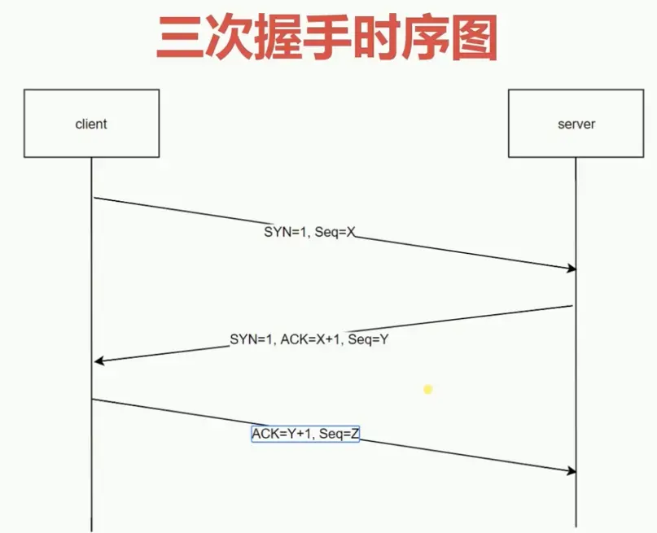
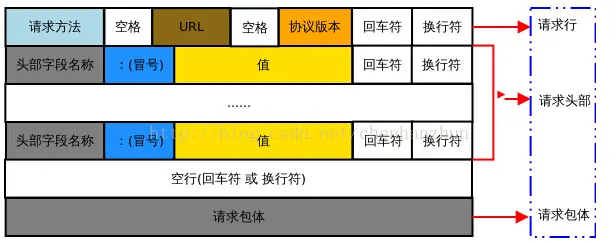
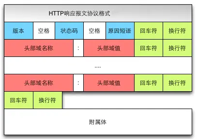
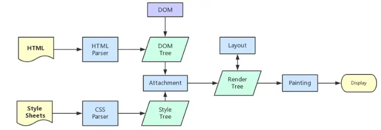
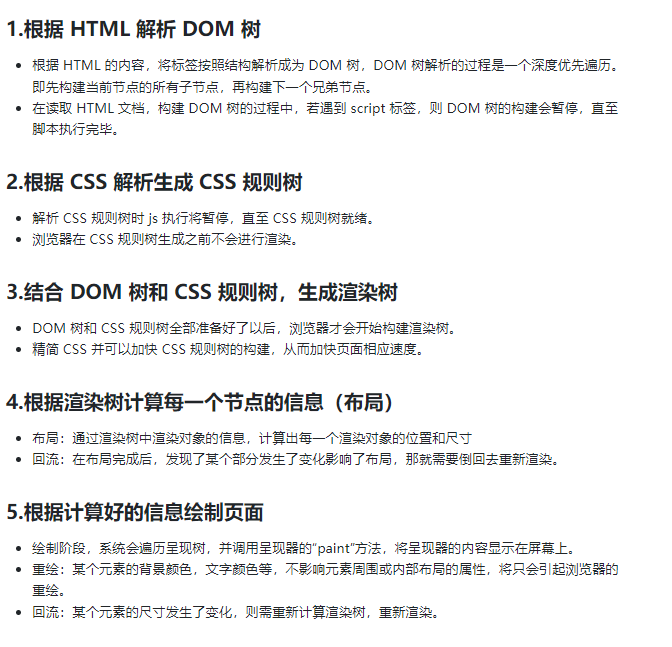
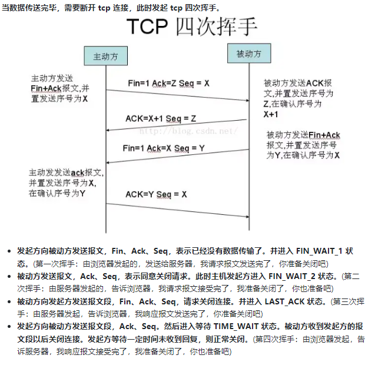

### 输入 URL 到页面展示
- DNS 解析:将域名解析成 IP 地址
- TCP 连接：TCP 三次握手
- 发送 HTTP 请求
- 服务器处理请求并返回 HTTP 报文
- 浏览器解析渲染页面
- 断开连接：TCP 四次挥手

### dns解析

在浏览器输入网址后，首先要经过域名解析，因为浏览器并不能直接通过域名找到对应的服务器，而是要通过 IP 地址。IP 地址是一个 32 位的二进制数

DNS 协议提供通过域名查找 IP 地址，或逆向从 IP 地址反查域名的服务。DNS 是一个网络服务器，我们的域名解析简单来说就是在 DNS 上记录一条信息记录。
`例如 baidu.com  220.114.23.56（服务器外网IP地址）80（服务器端口号）`

### dns查询流程
- 浏览器缓存：浏览器会按照一定的频率缓存DNS记录。
- 操作系统缓存：如果浏览器缓存中找不到需要的 DNS 记录，那就去操作系统中找。
- 路由缓存：路由器也有 DNS 缓存。
- ISP 的 DNS 服务器：ISP 是互联网服务提供商(Internet Service Provider)的简称，ISP 有专门的 DNS 服务器应对 DNS 查询请求。
- 根服务器：ISP 的 DNS 服务器还找不到的话，它就会向根服务器发出请求，进行递归查询（`DNS 服务器`先问`根域名服务器.com` 域名服务器的 IP 地址，然后再问`.baidu 域名服务器`，依次类推）

### TCP 三次握手
在客户端发送数据之前会发起 TCP 三次握手用以同步客户端和服务端的序列号和确认号，并交换 TCP 窗口大小信息。
#### TCP 三次握手的过程如下：
- 客户端发送一个带 SYN=1，Seq=X 的数据包到服务器端口（第一次握手，由浏览器发起，告诉服务器我要发送请求了）
- 服务器发回一个带 SYN=1， ACK=X+1， Seq=Y 的响应包以示传达确认信息（第二次握手，由服务器发起，告诉浏览器我准备接受了，你赶紧发送吧）
- 客户端再回传一个带 ACK=Y+1， Seq=Z 的数据包，代表“握手结束”（第三次握手，由浏览器发送，告诉服务器，我马上就发了，准备接受吧）


### 发送 HTTP 请求

TCP 三次握手结束后，开始发送 HTTP 请求报文。
请求报文由请求行（request line）、请求头（header）、请求体四个部分组成,如下图所示：


#### 1. 请求行包含请求方法、URL、协议版本
- 请求方法包含 8 种：GET、POST、PUT、DELETE、PATCH、HEAD、OPTIONS、TRACE。
- URL 即请求地址，由 <协议>：//<主机>：<端口>/<路径>?<参数> 组成
- 协议版本即 http 版本号
#### 2. 请求头包含请求的附加信息，由关键字/值对组成，每行一对，关键字和值用英文冒号“:”分隔。
请求头部通知服务器有关于客户端请求的信息。它包含许多有关的客户端环境和请求正文的有用信息。其中比如：Host，表示主机名，虚拟主机；Connection,HTTP/1.1 增加的，使用 keepalive，即持久连接，一个连接可以发多个请求；User-Agent，请求发出者，兼容性以及定制化需求。
#### 3. 请求体，可以承载多个请求参数的数据，包含回车符、换行符和请求数据，并不是所有请求都具有请求数据。
```js
name=tom&password=1234&realName=tomson
```
上面代码，承载着 name、password、realName 三个请求参数。

### 服务器处理请求并返回 HTTP 报文

响应报文由响应行（request line）、响应头部（header）、响应主体三个部分组成。如下图所示：


- 响应行包含：协议版本，状态码，状态码描述

  状态码规则如下：
  1xx：指示信息--表示请求已接收，继续处理。
  2xx：成功--表示请求已被成功接收、理解、接受。
  3xx：重定向--要完成请求必须进行更进一步的操作。
  4xx：客户端错误--请求有语法错误或请求无法实现。
  5xx：服务器端错误--服务器未能实现合法的请求。

- 响应头部包含响应报文的附加信息，由 名/值 对组成

- 响应主体包含回车符、换行符和响应返回数据，并不是所有响应报文都有响应数据


### 浏览器解析渲染页面

浏览器拿到响应文本 HTML 后，接下来介绍下浏览器渲染机制


浏览器解析渲染页面分为一下五个步骤：

- 根据 HTML 解析出 DOM 树
- 根据 CSS 解析生成 CSS 规则树
- 结合 DOM 树和 CSS 规则树，生成渲染树
- 根据渲染树计算每一个节点的信息
- 根据计算好的信息绘制页面




### 断开连接

